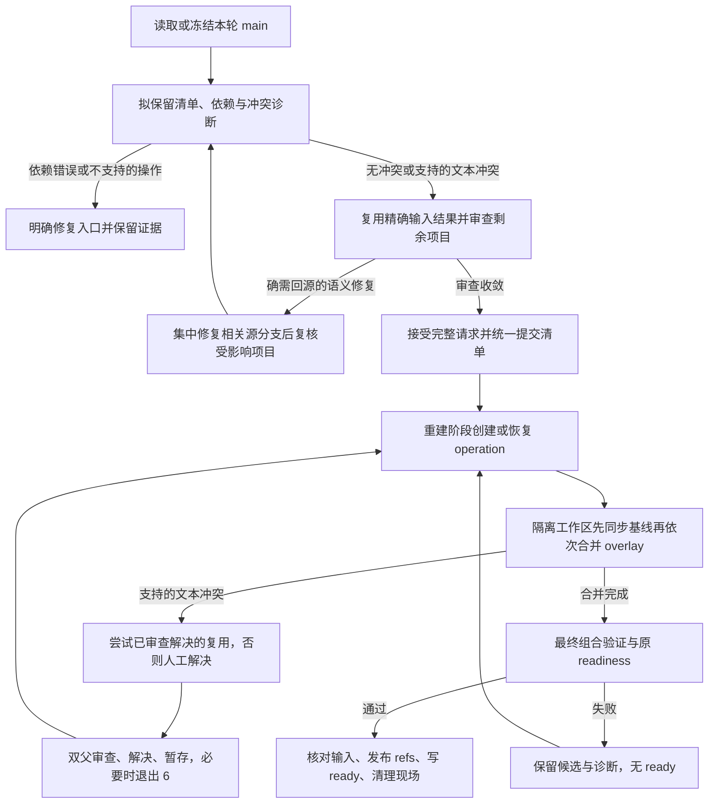

# rw-main 叠加冲突续跑与解决复用方案

状态：顾问复审后的最后两项 P3 已修正，本地验证完成（2026-09-15）。本文保留 v3 的设计、行为验收和审核依据；实际操作入口以 [打包流程.md](打包流程.md) 为准。顾问确认 A1–A3、发布恢复和冲突证据归档闭环；父代理随后补齐 `node:test` 识别及 app 显式 unit 测试例外，117 项控制测试及仓库检查通过。上一轮 115 项控制测试的审查证据见第 13.4–13.5 节，后续修订的验证见第 13.6 节；最后两项修正尚未再次交顾问审查。真实产品仓库尚未启用，也尚未采集实施后耗时样本。

## 1. 目标、完整交付与本次修订

保留现有 `main → rw-base → 清单叠加生成 rw-main` 结构。目标同时包括多分支组合正确性和缩短从请求开始到 ready 的准备时间，尤其减少非必要回源、重复审查和重复验证。

本次相对 v1 的修订：文本冲突的来源只用于诊断，不再据此强制 rebase；增加已声明依赖校验及有触发条件的交互验证；续跑和冲突复用共同构成完整交付；复用同一冻结输入下的已完成分支审查；以确定性计数验收重复工作，以真实分类日志观察耗时。

v2 经原顾问增量审核后，v3 删除了基线 receipt/control 重绑、强制依赖声明和诊断缓存，收窄了审查复用键与能力测试触发范围。v3 复审进一步把上游修改保留检查扩展到所有冲突路径，补齐 lifecycle 入口，并去掉单纯 HEAD 变化引起的候选重复测试。operation 仍只在清单提交后的重建阶段存在，不跨审查轮次。审核处理记录见第 13 节。

| 阶段     | 交付内容                                                               | 直接收益                                             | 交付判定                                                           |
| -------- | ---------------------------------------------------------------------- | ---------------------------------------------------- | ------------------------------------------------------------------ |
| 第一阶段 | 多分支依赖校验、按修复归属分流、隔离续跑、审查结果复用与记录           | 本轮文本冲突可以集中解决，避免非必要的回源和重复审查 | 基础能力完成，尚不能宣称已减少跨轮重复解冲突                       |
| 第二阶段 | 限定作用范围的 `rerere` 接入、重复冲突与准备时间验收                   | 对可匹配的重复冲突复用已审查的解决结果               | 与第一阶段共同组成此次提速目标的完整交付，不列为可无限后置的可选项 |
| 持续维护 | 长期功能使用现有 promote/maintain/retire；必要的组合适配进入版本化分支 | 减少反复叠加项目，让修复有明确归属                   | 独立于本次完成判定，不自动迁移用户功能                             |

能力边界：支持按已声明依赖顺序组合多条分支，处理支持范围内的连续文本冲突；不保证任意功能天然兼容，不穷举所有组合，也不把二进制等未覆盖冲突伪装成已支持。依赖审查、最终能力验证和异常阻断共同保护实际组合。

## 2. 保留的工作流约束

- `main` 只镜像上游；同一打包请求继续使用冻结快照和原 `run-id`，仅显式刷新才能推进快照。
- `rw-base` 保存长期本地功能，通过现有生命周期入口维护。
- `rw-main` 继续按清单顺序重建，允许删除已被上游吸收的功能。
- 控制面仍在 `chore/build-paseo`，产品构建仍在原构建目录，复用依赖和构建缓存。
- 语义审查、清单提交、最终 readiness、构建可信 stamp 和已有原子远端推送门禁保留。
- 暂停和验证失败时，正式 `rw-base` / `rw-main` 及对应远端 refs 不推进，不生成 ready state。首次同步上游时更新 `main` 的既有行为不受此约束影响。
- 不重启主 daemon；`--local-branch` 一次性测试叠加维持现有失败恢复行为。

## 3. 端到端流程



退出码 3/4 与完整请求接受机制保留。审查和清单没有变化时不制造新的审查轮次；有修复时尽量先收敛已经发现的问题，再统一提交清单。不能为追求“一轮”而省略新出现问题的复核。

预检不提供人工解决入口，也不把预检候选交给重建。它是轻量 Git 诊断，不安装依赖、不做 readiness；不把省掉几次预检当作主要提速来源。第二阶段的解决缓存只在受管实际合并中使用。

修复归属按语义决定：自用集成所需的文本协调可以记录在候选 merge，保留 PR 源分支；功能自身缺陷、需删除上游已吸收的重复实现、需要修改非冲突文件的适配，才进入相应源分支或显式适配分支。维护上游 PR 的 rebase 与本次生成自用版本分开，不因发生文本冲突就要求同步完成两项工作。

## 4. 诊断、依赖与审查去重

### 4.1 冲突诊断不等于回源命令

| 情况                                             | 判断方式                                                          | 处理                                                                                                   |
| ------------------------------------------------ | ----------------------------------------------------------------- | ------------------------------------------------------------------------------------------------------ |
| overlay 与冻结 main 独立合并即产生支持的文本冲突 | 用精确 SHA 做合并检查，例如 Git 2.43 的 `merge-tree --write-tree` | 标明上游冲突来源，允许进入审查；若只是文本协调，在最终候选中解决，不要求源分支先 rebase                |
| 只在叠加基线或前序 overlay 后产生文本冲突        | 在临时工作区按清单顺序合并冻结 SHA                                | 标明已知组合冲突，允许进入审查，留到最终重建解决                                                       |
| `rw-base + main` 冲突                            | 检查基线同步步骤                                                  | 支持的文本冲突只报告，不阻断审查；在 rebuild operation 的 sync 第 0 步解决，不需要另起纯同步 lifecycle |
| 功能自身缺陷、上游部分吸收、或需要非冲突文件适配 | 审查实际实现及接口契约                                            | 回源或显式适配分支；不以补丁相似或 Git 冲突本身作结论                                                  |
| Git 异常或未支持的冲突类型                       | 检查退出码、merge 状态、index 和错误输出                          | 明确失败原因并保留证据，不能把所有非零退出当作可续跑文本冲突                                           |

语义审查不因文本冲突而停止，否则可能先花时间修复最终会被删除的分支。独立 main 检查只提供诊断，不另建诊断缓存；现有样本中四次合并预检共 31 秒，暂不为这部分增加缓存和失效逻辑。实际顺序模拟到第一个冲突即停，其后的组合状态标记为“尚未检查”。不增加 N×N 两两合并矩阵：三方行为问题不能由两两文本合并证明不存在。

第一阶段覆盖普通文本与文本 `.patch` 冲突。二进制、子模块及未覆盖的路径结构冲突明确列为不支持。所有分流结论都不能代替最终业务语义验证。

基线同步由 rebuild 已有的 `rw-base + main` 步骤负责。准备阶段只报告支持的基线文本冲突，允许继续完成 exit 3/4；基线尚未合成时，组合模拟标为“尚未检查”。overlay 是否被 main 吸收的分支审查不依赖 rw-base 的解决结果，不应被它阻断。

清单提交后，rebuild 在 operation 中先执行 `sync` 第 0 步；发生冲突退出 6，完成双父及上游修改审查后，保存 base candidate，再按顺序合并 overlays。纯同步仍生成第二父为冻结 main 的合法同步 merge，不增加 lifecycle trailer 或新的 `manage sync` 命令。如果基线适配需要修改非冲突文件，abort 后进入对应功能的 maintain。

run-bound lifecycle 在创建工作区和执行任何合并前，检查冻结 main 下的清单审查坐标是否已匹配；未完成则提前拒绝并指出尚缺的审查，避免先解完冲突才在 finalize 撞墙。一个 run 如果需要 promote/maintain/retire，应先完成审查与 exit 4 清单提交，再直接运行 lifecycle，由它的 finalize 完成唯一一次最终重建；不要先重跑 prepare 做一轮 readiness。

standalone lifecycle 同样在 main 同步之后、创建 operation 工作区之前检查清单审查坐标。它仍保留继续时检查上游是否前进的既有约束；可能遇到 overlay 冲突、需要多次暂停的 lifecycle 应使用 run-bound 模式，避免暂停期间上游变化迫使整轮作废。

不引入 `awaiting-overlay-review`、`--base-operation`、receipt 或 control HEAD 重绑。普通 continue 始终使用原冻结 control；外部 lifecycle 提供的已准备 base candidate 仍通过原 `--base-candidate` 入口接入。

### 4.2 可选依赖声明与移除提示

在现有清单行中允许有界的可选注释，例如 `# depends-on:feat/A,fix/B`。未声明时报告显示“未声明”，不能据此断言功能彼此独立，也不因缺字段阻断既有清单。祖先关系和路径重叠只能提供线索，不能代替逻辑依赖判断。

对已声明关系检查引用存在、无自依赖/循环、前置项目排在依赖者之前。脚本不自动排序、引入额外分支或移动 refs。A 拟移除时，在其已声明依赖者的现有审查报告中提示核对替代能力，沿用原有逐分支语义审查，不增加一套替代审批流程。接受前，清单内保留的依赖引用和顺序必须有效；main 提供替代时，随现有审查更新声明并记录证据。

移除 A 的请求必须把仍保留的已声明依赖者 B 纳入审查集合，即使 main 和 B 的 HEAD 均未变化；在同一次接受写回中删除 A 及经审查确认已不需要的依赖引用。没有替代依据就拒绝移除，不能自动删引用冒充依赖已解除。依赖替代核对独立于“是否被 main 吸收”的结论缓存，后者不能免除前者，也不要求先手工改脏控制面清单。

解析、修改 PR 映射、补充 PR、接受审查等所有清单写回路径都必须保留该元数据；不能继续以整行重建或截断 `reviewed-main` 之后的文本丢失注释。它只标注已知依赖，不承担审查缓存的失效传播。

三方交互作为确定性 fixture 验收：C 即使无文本冲突，也可能改变 A/B 共用接口或行为。实际请求的额外能力检查按第 8 节触发，不为七条分支每轮增加七套固定检查。

### 4.3 同一请求的分支审查复用

此处审查只回答“相对冻结 main，该分支是否已被吸收、是否仍需保留”。它不证明基线、顺序或多分支组合正确。保留每个精确区间都有证据、最终接受完整请求的要求，不新增绕过审查参数。

- 同一上游区间先生成一次公共变更材料，各分支复用材料并保留各自结论。
- 在 run 目录记录已完成结论。复用键严格采用现有 review request 的 branch 行（branch、main 起止 SHA、head 起止 SHA），加 PR 身份映射与审查规则文本哈希。结果必须带证据，未完成或“需要回源”不能当作已接受结果。
- 不把 control HEAD、rw-base、清单顺序或其他分支 HEAD 塞入此键。B 回源后，B 的 head 区间变化使其自身结果失效；不以依赖关系强制使 A 或其他项目的“是否被 main 吸收”结论失效。
- main 区间、PR 映射或审查规则变化时，重审键变化的项目；不能仅按文件路径不重叠跳过原有语义审查。
- 接受前仍核对必要 PR 身份/合入信息、全部冻结输入和当前请求项目集合。复用结果与本轮新结论一起覆盖完整集合后，调用现有接受入口。
- 已声明依赖、冲突解决与最终候选验证分别有自己的检查边界。不得拿分支审查缓存免除这些检查。

这些结论只在同一请求重试中自动复用，跨 run 不自动接受旧结论。源修复与审查按既有规则组织；主代理在证据收敛后统一接受，不新增固定人工批准轮次。

## 5. operation 的归属与数据

### 5.1 归属

`rebuild-rw-main.sh` 拥有合并进度与候选内容。`prepare-rw-main-for-build.sh` 和 `manage-rw-base.sh` 仍分别拥有打包请求、生命周期请求、构建锁及 ready state。

在原构建目录之外创建独立工作区，沿用 rw-base operation 的同级目录布局，例如 `.paseo-rw-main-operations/<id>/worktree`。构建目录 `.dev/` 内仅保存小型索引和日志，避免嵌套源码被 TypeScript、格式化工具或 Metro 扫描。

每个构建目录最多存在一个未完成的 rw-main operation。原请求重试时先查现有 operation，再决定是否创建候选。输入不匹配就保留现场并拒绝接续，不能悄悄再起一份。

### 5.2 冻结输入

不可变请求记录并内容寻址以下信息：

| 输入                                                             | 用途                               |
| ---------------------------------------------------------------- | ---------------------------------- |
| operation 版本、调用方种类、run-id 或父 lifecycle operation 身份 | 确认恢复的是同一请求               |
| main SHA 与原请求快照时间                                        | 保持本轮上游边界                   |
| 原 rw-base 和 rw-main SHA                                        | 拒绝覆盖暂停期间的正式分支变化     |
| control HEAD、清单内容标识、按顺序的 branch/SHA 列表             | 绑定控制逻辑和实际组合             |
| 基线输入模式：从原 rw-base 同步，或外部候选 SHA                  | 恢复同一基线输入；外部候选必须固定 |
| 外部 base candidate 的来源与父 operation 标识                    | 管理 lifecycle 依赖和清理顺序      |
| 构建目录、ready state 目标、dry-run/push 意图及推送租约坐标      | 防止续跑改变目标或发布意图         |

调用方须显式传入 run/lifecycle 上下文；现有 rebuild 只有 `--frozen-main`，不能据此推断 run-id。内部上下文参数与用户操作入口分开，不要求用户重复抄写冻结 SHA。

operation 在 sync 开始前创建：不可变请求冻结原 rw-base/main，或外部候选 SHA，不要求尚未生成的同步结果存在。sync 完成后的 base candidate SHA 写入原子进度，并校验其父提交和解决树；恢复时复用它，不能重新生成带时间戳的 merge。这样纯基线冲突也能在已有 operation 内暂停，不会出现“先有候选才能创建解决候选所需的 operation”的循环。

单独的原子写入进度记录保存：当前阶段、冲突所属 sync/overlay 步骤、overlay 索引、合并前 HEAD、期望的另一父提交、候选分支、冲突快照、解决树、验证与发布进度。会创建 clean merge commit 的步骤在调用 Git merge 前先写入冻结双父及提交说明，clean merge 后再原子补记由固定双父重建核对的预期 tree，使首次 tree 记录前及提交后、完成记录首次落盘前的中断都可被精确恢复。冻结源 head 已在当前合法前缀中时，另写可核对的 no-op 步骤记录并推进索引，不创建空提交。不可变请求不随着这些进度变化而重新编号。

### 5.3 状态

| 状态                | 含义                                       | 重试行为                                                        |
| ------------------- | ------------------------------------------ | --------------------------------------------------------------- |
| sync                | 同步原 rw-base 与冻结 main，或验证外部候选 | 解决支持的基线文本冲突后保存候选；外部候选验证后进入 assembling |
| assembling          | 正在按顺序合并                             | 从已核对的步骤继续                                              |
| conflict            | 存在待解决的文本冲突                       | 未解决时再次暂停；解决并审查后提交、继续                        |
| assembled           | 所有合并完成，候选内容固定                 | 将同一候选交给构建目录验证                                      |
| validation-failed   | 候选验证失败                               | 环境修复后重试验证；需要源码变化则 abort 并回源                 |
| publishing          | 已验证，正在更新远端和本地 refs            | 核对真实 refs 后恢复，不重复发布                                |
| completed / aborted | 已完成或显式放弃                           | 保留审计记录，移除本 operation 拥有的现场                       |

合并提交成功与进度写入之间可能中断。恢复时核对预期父提交和已记录的解决树，确认该步骤是否已经完成；既不能重复合并，也不能只凭当前 HEAD 变化就跳过一步。

## 6. 冲突解决与继续

### 6.1 保存现场

发生可支持的冲突时，不论独立 main 诊断还是组合诊断是否发现过它，都保存两侧父提交、原 index stage 信息、完整冲突路径集合，以及 `AUTO_MERGE^{tree}` 的 OID。保存完成后退出 6，打印：

```text
PASEO_RW_MAIN_OPERATION=<request 的绝对路径>
PASEO_RW_MAIN_OPERATION_WORKTREE=<隔离工作区>
PASEO_PREFLIGHT_STATUS=integration-conflict
PASEO_RW_MAIN_CONFLICT_PHASE=<sync 或 overlay>
```

同时打印当前分支、冲突路径和对应调用方的重试方式。退出时释放构建锁，保留 operation 工作区和所有候选引用；产品构建目录应保持原分支且洁净。

### 6.2 解决边界

解决者可以是执行任务的主代理，不新增固定的人工审批轮次。沿用现有双父审查规则，解释每个冲突路径相对双方保留、合并或删除了什么。

- `add/add` 不能任意选边；不相交功能应保留语义并集。
- `.patch` 按内部目标与 hunk 审查，沿用现有 patch 注册、重复执行和安装验证门禁。
- 必须暂存完成结果，不允许未解决 index、遗漏的未暂存修改或无关未跟踪文件被带入提交。
- 相对保存的 `AUTO_MERGE` 比较 staged tree，新增人工修改只能位于原冲突路径中；已经自动合并的非冲突文件应保持原结果。不能直接与第一父提交比较路径，否则会误拒绝正常引入的功能文件。
- 路径限制只是机械边界，不能证明同一文件内没有混入无关修改；仍需审查实际解决 diff。
- 不手动提交、rebase 或重置 operation 分支，提交由续跑入口完成。

解决记录绑定原请求、两侧父提交和最终 staged tree。暂存内容改变后，先前审查记录失效。该记录不写入清单的 `reviewed-main/reviewed-head`，不会产生新的 exit 4 循环。

对每个冲突路径检查源输入尚未包含的 main 历史，不按“main 冲突”或“组合冲突”的诊断分类决定是否检查。overlay 使用 `git log <branch-head>..<frozen-main> -- <path>`；rebuild 和 lifecycle 的 sync 均使用 `git log <base-before>..<frozen-main> -- <path>`，不能把 sync 的另一父 main 当作这里的源输入而得到空区间。lifecycle 的 feature 使用冻结的功能 head，replay 使用被重放的原提交，分别检查到冻结 main 的区间，同样生成并校验必填 upstream 行。所有 SHA 均取冻结请求和该步骤已记录的输入，不能读取移动后的分支 ref，也不能用接受后已更新的 `reviewed-main` 替代。

区间非空时，列出涉及该路径的上游提交，逐项说明保留的行为，或被哪个修改取代及依据。冲突块外的改动可注明“已在块外自动合并”；涉及重命名时逐个路径用 `--follow` 补齐改名前的历史。缺少对应说明就不能继续；同一组输入可复用已审查的记录。区间为空仍须完成原双父审查，不能据此直接接受解决。

例如旧 forge 的 `run-git-command.ts` 必须保留上游禁用 repository fsmonitor 命令的行为；旧 todo 虽然与 main 独立合并干净，它的组合冲突也必须保留 `registry.ts` 已包含的上游订阅修复。最终候选还需运行第 8 节限定的测试，包含上游新增的 `run-git-command.posix.test.ts` 和 `registry-lifecycle.test.ts` 等实际相关文件。

### 6.3 Git hooks 与配置

受管隔离候选的 merge/commit 在命令级关闭 hooks，避免没有 node_modules 的工作区触发共享 pre-commit，或对每次冲突重复运行全仓 typecheck。最终候选仍执行既有完整 readiness；正常源分支和控制面提交 hooks 保持原行为。

第一阶段实现期间显式禁用 rerere 及自动暂存，建立可验证的原始冲突快照。第二阶段按 9.2 的限定流程接入复用；这一步属于完整交付。方案编写和审核期间不修改 Git 配置。

`snapshot_conflict`、上游修改证据检查、必要的 patch 处理和验证逻辑在两个 operation 使用处共享；manage 的 sync 续跑也必须经过上游证据检查，不能成为回源 maintain 后的旁路。抽取时保留原 rw-base patch 校验和生命周期语义。不要为状态存储再建立一套通用工作流框架。

## 7. 入口、退出码与锁

### 7.1 用户操作

创建和恢复沿用既有调用方，不新增必须逐层透传的 continue 命令：

- 普通打包：用同一 `--run-id --no-fetch` 重跑 prepare，保持原 state-file 和发布选项；进入 rebuild 后自动恢复匹配的 operation。
- lifecycle：沿用 `manage-rw-base.sh continue --operation <原 rw-base request>`，由 finalize 恢复关联的 rw-main operation。
- 已暂停的请求不能同时接受新清单变更或刷新 main；需要换输入时，先显式 abort，再进入正常流程。

新增两个诊断/清理入口，以下是拟定接口，实施前不能直接使用：

```bash
bash "$paseo_chore_root/dwyanewang/rebuild-rw-main.sh" \
  --build-root "$paseo_build_root" \
  --operation-status "$paseo_rw_main_operation"

bash "$paseo_chore_root/dwyanewang/rebuild-rw-main.sh" \
  --build-root "$paseo_build_root" \
  --abort-operation "$paseo_rw_main_operation"
```

status 输出冻结输入、当前阶段、冲突及父 operation。abort 只清理确认为本 operation 所有且尚未进入发布阶段的工作区、分支和活动索引，保留审计，不删除 rr-cache、不回滚已发布 refs、不清理其他请求；`publishing` 和 `awaiting-ready` 一律要求恢复完成，不能依赖尚未来得及写入的发布标志放弃现场。

### 7.2 退出码

| 退出码 | 含义                                                                             |
| ------ | -------------------------------------------------------------------------------- |
| 0      | 当前命令成功；只有明确的 ready 结果才能进入产物链，status/abort 成功不代表 ready |
| 1      | 普通失败、输入漂移、非支持冲突或验证失败，输出具体阶段与修复入口                 |
| 2      | 参数错误                                                                         |
| 3      | 现有语义审查待完成                                                               |
| 4      | 现有清单待提交                                                                   |
| 5      | 现有 rw-base lifecycle 冲突暂停                                                  |
| 6      | 新增 rebuild 的 sync 或 overlay 文本冲突暂停                                     |

prepare 和 lifecycle 都须透传 6，并且不执行后续 ready 写入。保留真实失败退出码和阶段，不能把所有错误统一改写为“请解冲突”。

### 7.3 并发与调用方

所有变更操作共用现有构建锁。prepare/manage 持锁调用 rebuild 时传递明确的锁上下文；rebuild 不能重复打开同一路径造成自锁。直接执行 rebuild 的变更入口也必须取得该锁，不能留下无锁路径。持锁校验不能只信任一个布尔环境变量。

原样重试要在任何 fetch、main 更新或清单写入前识别活动 operation，拒绝非匹配请求。续跑重新取得锁后核对全部冻结输入和候选状态；tracking main 按原 run-bound 规则允许前进，本地 main 仍必须等于快照。

父 lifecycle 与子 rw-main operation 显式关联。第一阶段选择拒绝直接 abort 有活动子 operation 的父请求，提示先 abort 子请求，再 abort 父请求。避免静默级联删除待审修复。

## 8. 最终组合验证、发布与中断恢复

隔离工作区完成合并后，在原产品构建目录创建独立验证分支，指向同一个候选 SHA，复用原依赖与缓存。不要在两个 worktree 同时检出同一分支。只对最终候选运行 readiness，不按 overlay 或冲突次数增加检查。

继续沿用“内容树和工具链/依赖/dist 输入一致可复用 readiness，正式产物链需要 exact HEAD stamp”的既有规则。编译检查不替代冲突语义审查。

额外的候选能力检查只在两种情况下触发：涉及冲突解决；已声明的 `depends-on` 关系中任一方 HEAD 变化。比较基准直接使用创建 operation 时当前已发布且通过 readiness 的 `rw-main`，通过已有合并父链识别其输入，不另建“上次成功候选”记录或共享接口注册表。新增依赖关系按相关双方检查；基准无法识别时只核对受影响的已声明关系，不扩展到全部功能。原有 `rw-main` 可信性和 readiness 门禁仍保留。

仅功能 HEAD 变化且未触发上述条件时，引用源分支已有的验证记录，不在候选上重复执行同一批测试；缺记录时沿用既有源修复验证要求。其余情况沿用已有 readiness，不为每条功能每轮增加固定成本。“C 没有文本冲突却破坏 A/B”保留为已声明依赖关系的 fixture 场景，不宣称能自动发现所有未声明交互。

冲突测试只枚举已归档的真实冲突快照。候选包括精确的 `<stem>.test.*`、`.posix.test.*`、`.windows-shell.test.*` 直接回归，以及在 overlay 或相关上游区间内实际修改过、且与冲突路径同名相关的扩展测试；不无条件收集同前缀的全部邻近测试。依赖区间也只选择与变化源文件关联的测试，或有对应源文件的变化测试。路径规范化并去重；排除 `*.e2e.test.*`、`*.browser.test.*`、`*.real.*`、`*.local.*`，把排除原因和平台不适用项记为覆盖缺口，不能记为通过。

先完成 readiness 构建及检查，再按 workspace 配置运行明确的文件清单：有包级 Vitest 配置时从该包执行，app 指定 `--project unit`，没有包级配置的包使用根配置。每批最多 8 个，顺序执行全部选定文件并记录批次，不将整个目录或 workspace 当作测试范围。

文件名符合 `.test.*` 还不足以决定 runner。导入或 require `node:test` 的文件记录为 `node-test-runner` 覆盖缺口，不交给 Vitest；CLI `tests/` 的脚本测试及非 Vitest 扩展名同样排除。app 的已知 unit 范围除 `src/` 下 ts/tsx 外，还包含产品配置显式声明的 `native-release-version.test.ts`；这个直接回归仍用 app 的 `--project unit` 执行。

适用集合超过 32 个时，在当前 operation 生成 `capability-test-selection.tsv`，绑定候选 tree 和完整适用集合哈希。对每一行填写 `run|skip` 和非空审查依据后原样重试；直接回归必须 `run`，扩展测试的取舍记录为覆盖缺口。32 是自动选择门槛，逐项审查后可保留超过 32 个必要测试，仍按 8 个分批运行；不能为满足数量阈值丢弃必要覆盖。无需 abort、修改源分支或重新解决冲突。测试确实失败且需要修改非冲突文件时，仍须回源或使用适配分支。

没有可用的相关测试时，明确记录覆盖缺口，采用“上游修改保留证据（若存在）+ 双父语义审查 + 既有 readiness”完成本次检查；补测试列为源分支后续工作，不仅因缺少邻近测试就强制本次回源。已经发现的行为错误或失败不能借这个规则放行。按冲突和已声明依赖触发新增检查，不等于免除既有语义审查或 readiness。

新增的针对性能力检查如果需要复用结果，另记最终 tree、平台、依赖与工具链、readiness 构建后的 dist、执行器、workspace 配置和测试取舍等实际输入与结果；现有 readiness stamp 本身不能证明这些新检查已运行。测试失败可复用已完成的 readiness，但不能复用失败的能力结果。测试结束后再次检查候选洁净度，测试造成的未提交修改既不能记录 PASS，也不能进入发布。

readiness 失败时保留 operation 和日志，不写 ready，不推进产品 refs。能够安全切回时恢复产品目录原分支；若验证产生了未提交文件，报告并保留，不使用强制清理覆盖未知修改。环境修好后可重新验证同一候选；源码适配必须 abort、回源或调整版本化分支后重新审查。

发布前再次核对冻结输入。远端继续用带精确租约的 atomic push，再完成本地 refs 和构建 checkout 更新；不声称本地与远端构成一个原子事务。

发布阶段中断时，恢复逻辑以真实 refs 为准：仍为冻结旧值的步骤可继续；已等于预期候选的步骤视为完成；第三种值说明外部变更，保留现场并停止。远端已成功、本地尚未完成时，不重新组装、不重复强推，也不允许用 abort 伪装回滚成功。

ready 写入成功后才清理活动现场。refs 已成功但 ready 写入失败时，保留已发布结果及恢复证据，沿用原请求补写状态，不再次发布。

## 9. 审计与第二阶段

### 9.1 第一阶段的保留内容

run 目录保留请求输入、冲突路径、两侧父提交、AUTO_MERGE tree、解决后的 tree/merge SHA、解决 patch、审查说明、验证结果和完成/放弃状态。standalone lifecycle 的记录放在对应 operation 审计目录，完成时只删除运行现场。

这些记录用于追溯。SHA 字符串不能阻止 Git 对失去引用的对象做 GC，patch 记录也不等于任意历史环境都能完整复现。第一阶段不承诺永久归档所有历史对象；同一 operation 内的提交由受管分支保证可达。

### 9.2 第二阶段：rerere（完整交付必需）

复用以第一阶段的暂停、审查和提交边界为基础：能匹配时恢复文件内容，仍然检查、暂存并通过最终验证；不能匹配时继续正常暂停。

同一仓库的 worktree 共用 rr-cache，且未显式设置 `rerere.enabled` 时，已有 rr-cache 目录可能让 Git 默认启用 rerere。第二阶段必须处理这一仓库级影响，不能只在一个 merge 命令上开启后就认为其他工作区不受影响。

目标配置策略：在正式接入时明确设置仓库默认禁用。受管 merge 显式禁用 rerere；快照完成后的缓存应用、已审查解决的记录及后续 commit 才使用命令级启用，并显式保持 `rerere.autoupdate=false`。已有配置先读取和报告，不静默覆盖用户原有的全仓启用意图；本方案整理阶段不修改配置。

先禁用 rerere 执行 merge，保存原始 index/AUTO_MERGE 快照后，再在同一受管工作区显式调用 rerere，使复用不会覆盖审查基准。复用文件内容不代表完成暂存或审查。

只有明确完成审查的解决结果才写入可复用的解决记录；预检不学习或应用解决缓存。遇到错误匹配，只修正当前冲突对应的记录，不清空其他工作区共享的全部缓存。第一次解决、后续复用、错误匹配纠正、缓存缺失和 GC 后回到普通暂停，都应有独立验收。源分支、其他工作区及现有用户配置的影响须实测，不能仅凭命令参数宣称隔离成功。仓库默认禁用后，受管显式调用必须使用 `git -c rerere.enabled=true rerere`；裸 `git rerere` 不会完成预期复用。

配置选择属于实施范围，需要与届时用户授权和既有配置意图一致。如果用户明确禁止所需的共享配置变更，可以单独交付第一阶段并把第二阶段记为待决策；不能擅自改配置，也不能据此把整个提速目标标为完成。当前仅编辑方案，不执行配置变更。

### 9.3 功能与适配的归属

长期功能继续通过 rw-base 生命周期维护。追加历史能保留已经提交的解决，但后续上游变化仍可能再次要求适配。

不强制回源是延后不必要的源历史重写，并不保证永远无需 rebase，也不会让上游 PR 自动恢复可合并状态。按分支记录来源为 main 的冲突及 rerere 匹配情况；同一分支在第二个 run 再次出现 main 冲突，或已有记录仍未匹配时，输出不阻断的回源维护建议并计数。持续变化的接口、反复失配和必要的非冲突文件适配，是安排一次源维护的信号；不能每轮强行 rebase，也不能无限重复同一段手工解决而不报告。

无文本冲突的组合修复可以使用现有显式 overlay 表达，绑定清晰依赖、顺序和审查坐标。放在清单末尾的适配分支不能解决前面已经阻断的 merge；此类问题应修改更早的输入、调整明确的依赖设计或纳入基线，不能把“加一条适配分支”当成通用冲突消除器。

## 10. 文件改动范围与实施顺序

| 位置                                  | 第一阶段职责                                                           |
| ------------------------------------- | ---------------------------------------------------------------------- |
| `sync-rw-main-branches.sh`            | 冲突诊断不强制回源、可选依赖校验与移除提示、逐分支审查证据复用         |
| `rebuild-rw-main.sh`                  | 隔离组装、operation 持久化与恢复、解决边界、status/abort、最终候选交接 |
| `prepare-rw-main-for-build.sh`        | 早期识别活动 operation、传入 run 上下文、透传暂停码、ready 与锁衔接    |
| `manage-rw-base.sh`                   | lifecycle 前置审查、共享上游证据校验、透传子暂停码、父子恢复与清理     |
| 共用冲突/状态代码                     | 复用必要的快照、patch 校验、原子状态和锁能力；按实际两处调用抽取       |
| `打包流程.md` 与 build-paseo 技能说明 | 更新冲突分类、退出码、继续/放弃、双父审查和恢复步骤                    |
| 对应控制面测试                        | 在已有真实 Git fixture 中证明新行为与原门禁                            |

按纵向小步实施，每步完成相应测试和代码，不先堆积全部测试或通用框架：

1. 基于已有分类事件固定计数与观察口径；可选依赖校验、修复归属及分支审查复用各自通过最小场景。
2. 隔离组装、sync 第 0 步、首次暂停及连续冲突恢复，覆盖基线同步、独立 main 冲突与组合冲突。
3. 请求冻结、status/abort、异常和中断恢复、hook 边界。
4. run-bound/standalone lifecycle 提前检查审查门禁、prepare/lifecycle 正确编排、按触发条件验证、发布恢复和审计清理。
5. 在稳定的续跑基础上实现 rerere，验证重复冲突复用及共享配置影响。
6. 文档与技能同步；两阶段行为验收、确定性计数验收与分类耗时观察完成，才能宣布本次完整交付。

每步保持已有 `target_matches_inputs` 所需的合并父链语义，不额外插入普通单父“解决提交”。跨审查轮次复用整个候选、任意集成补丁自动重放、永久 refs 归档及无关 lifecycle 重构不属于此次实现范围。基线 sync 与 overlay 合并属于同一重建操作，整个操作期间 control HEAD 始终冻结。

## 11. 验收标准

使用已有 fixture 创建真实临时 Git 仓库、worktree 和 bare 远端；Git 合并、index、提交和 push 均真实执行。仅用现有假 npm/mise 隔离昂贵构建与工具链安装。这些是流程测试，不宣称替代真实产品构建。

| 场景                    | 必须证明                                                                                                                               |
| ----------------------- | -------------------------------------------------------------------------------------------------------------------------------------- |
| 依赖与三方交互          | 已声明依赖的引用缺失、循环、顺序错误提前阻断；移除 A 后对依赖者 B 的替代能力需审查；C 无文本冲突却破坏 A/B 时能力验证失败              |
| 审查精确复用            | 同一键结果只做一次；修复 B 使 B 的分支审查键失效，其余键匹配结果可复用；组合/依赖检查仍独立执行；最终接受集合完整                      |
| 重复冲突复用            | 同样冲突下一轮由 rr-cache 恢复内容但仍需审查；不再重新编辑相同解决，源码 HEAD 保持不变                                                 |
| 缓存失效与隔离          | main/自身 HEAD/PR 映射或审查规则变更使分支结论失效；错误 rerere 匹配可纠正，其他工作区不被意外启用                                     |
| 非必要回源为零          | 单纯 main/overlay 文本冲突用例中没有源分支 rebase、源 push 或因源 HEAD 改写产生的额外审查轮                                            |
| 必要回源仍有效          | 上游部分吸收或功能自身缺陷时执行必要源修复，不能借候选解决隐藏重复实现                                                                 |
| 连续两轮与收敛          | 第二轮 main 冲突复发或已有记录未匹配时输出不阻断的维护建议，计数准确，不擅自 rebase                                                    |
| 上游修改保留            | 独立 main 冲突与组合冲突均保留上游 fsmonitor/订阅修复；覆盖重命名历史、上游新增测试及 manage sync 续跑；遗漏说明或测试失败不能接受候选 |
| 能力检查触发            | 冲突或已声明依赖双方 HEAD 变化触发有限检查；单纯 HEAD 变化引用源验证；无邻近测试记录覆盖缺口并按证据和 readiness 检查，不强制回源      |
| 清单元数据保留          | depends-on 在各写回路径保留；移除 A 且 main 未变化时 B 仍需核对替代，接受后同次清除引用；吸收结论缓存不能免除替代核对                  |
| lifecycle 前置门禁      | run-bound/standalone 审查未完成均在建工作区前拒绝；清单提交后直接 lifecycle 只重建一次；长暂停使用 run-bound 保持冻结快照              |
| 无冲突正常流程          | 审查、清单、父链、stamp 和发布行为保持原有语义                                                                                         |
| 组合冲突完整路径        | request 可到 3、accept 可到 4，清单提交后到 6；暂停时产品目录洁净，产品 refs 不变，没有 ready 和构建调用                               |
| main 独立冲突与基线冲突 | 两者支持的文本冲突均可进入重建暂停；sync 作为第 0 步，control 不重绑，普通错误仍阻断                                                   |
| 多个 overlay 与多次冲突 | 完成前一个解决后接着处理后一个，不重写或重新合并已完成前缀                                                                             |
| 正确解决                | 暂存后原样重试成功，解决记录对应实际 tree，最终父链符合现有 no-op 检查                                                                 |
| 非法解决                | 未 add、未解决 index、无关 staged/unstaged/untracked 修改、人工改 HEAD 均被拒绝并保留证据                                              |
| `.patch` 冲突           | 双方目标与语义并集、注册与应用检查没有退化                                                                                             |
| hooks 与检查次数        | 放入必然失败的 pre-commit hook，证明隔离提交不调用它；每次必要的 readiness 按既有顺序执行，不逐分支重复                                |
| 输入漂移                | main/base/target/control/overlay/顺序或请求身份变化时拒绝恢复；远端 main 前进仍按冻结规则处理                                          |
| 锁与并发                | 第二个变更请求不能抢占现场；拒绝取锁时不误删原状态；续跑和直接 abort 使用同一把锁                                                      |
| lifecycle 子暂停        | 6 不被吞成 1，父子现场都保留，继续可完成，先子后父的 abort 顺序有效                                                                    |
| 验证失败                | 不发布、不写 ready，候选与日志保留；环境修复后可验证同一候选                                                                           |
| 中断与发布重试          | 覆盖 merge 提交后、进度落盘前，以及远端成功后、本地/ready 完成前；不重复提交或推送                                                     |
| 非支持冲突和 Git 错误   | 保留诊断、不生成 ready，不把它们误报为已经支持的文本冲突                                                                               |
| dry-run 与 local-branch | dry-run 不移动正式 refs，local-branch 仍按原路径恢复，不能串用 operation                                                               |

优先扩展 `scripts/rw-main-review-gate.test.mjs`、`scripts/prepare-rw-main-for-build.test.mjs` 和 `scripts/rw-base-lifecycle.test.mjs`；修改 stamp 或共享状态行为时才补对应 `scripts/build-paseo-state.test.mjs`。

只运行实际改动的单个测试文件，例如 `npx vitest run scripts/rw-main-review-gate.test.mjs --bail=1`；顺序运行，不执行全仓测试。按仓库要求运行 npm 格式化、lint 和 typecheck；跨包声明问题先构建声明拥有方，不能为测试流程而修改产品类型。首次真实集成验收只对一个最终候选运行已有 readiness，不额外执行整套产品打包。

## 12. 准备时间的证据与效果验收

### 12.1 已观察到的分类基线

2026-09-12 请求 `20260912-084721-3668777` 的本机阶段日志位于产品目录 `.dev/build-paseo-runs/<run-id>/preflight-stages.log`。首次 preflight 08:47:42，到成功结束 09:36:03，总墙钟 48 分 21 秒，不含正式产物构建。

| 顶层互斥类别            | 耗时          | 证据与口径                                                             |
| ----------------------- | ------------- | ---------------------------------------------------------------------- |
| 各次 preflight 执行合计 | 约 10 分      | 按事件时间戳为 10 分整；elapsed 字段合计 10 分 1 秒，存在 1 秒取整差异 |
| forge 源修复            | 9 分 45 秒    | source-repair 08:48:34 → 08:58:19                                      |
| todo 源修复             | 20 分 12 秒   | source-repair 08:58:50 → 09:19:02                                      |
| 分支审查                | 5 分 13 秒    | review 09:19:56 → 09:25:09                                             |
| 清单提交                | 1 分 34 秒    | manifest-commit 09:25:32 → 09:27:06                                    |
| 尚未归因的间隔          | 约 1 分 37 秒 | 总墙钟扣除上述互斥时间戳区间                                           |

preflight 中最终 readiness 为 8 分 48 秒，四次合并预检合计 31 秒，均已包含在上表第一项中，不能重复累计。v2 曾把所有轮间间隔合并描述为约 38 分 20 秒；已有事件足以进一步拆分，应采用本表。

顾问按历史输入核对：todo 的旧 head `38ebccb9a` 与冻结 main 独立合并干净，属于与前序 forge 的组合冲突；forge 的旧 head `a900da83e` 与 main 本身冲突，且源修复还有 `run-git-command.test.ts` 的必要适配。这说明原续跑方向已针对组合冲突，允许 main 冲突在候选中解决则扩大覆盖范围；两类不能混为同一种新增收益。

上述修复时间都包含必要工作，不能把 20 分钟或 10 分钟全部算作新流程可节省时间。没有实施后的分类证据，不给出提速比例。

### 12.2 主验收：fixture 的确定性计数

在独立 fixture 仓库及 bare 远端中验证源 rebase/push 次数、实际重审行数、完整 readiness 实际执行次数、从头创建 operation 次数、已完成合并前缀是否重做，以及重复冲突是否需要重新编辑。模拟源修改只发生在 fixture 内，不为基准测试 rebase 或 force-push 用户的真实 PR 分支。

每个 fixture 明确初始依赖缓存、rr-cache、readiness stamp 的状态，分别测试冷缓存、匹配复用和失效路径。审查与编辑采用固定输入/预定动作，计数断言不依赖人或代理第二次处理同一问题更熟练的学习效应。真实性能时间不从这些假 npm/mise 测试推导。

### 12.3 真实请求：观察与分类报告

复用既有 source-repair、review、manifest-commit 和 preflight/readiness 事件；只补缺少的审查复用、冲突复用及检查触发计数，不另建一套相同计时。不能观测的活动记为未归因，不猜测归类。

真实请求记录总准备墙钟、源 rebase/push、逐分支实际审查/复用、清单接受、operation 从头重启、冲突编辑/匹配、readiness 实际执行和 stamp 命中。区分调用与执行，嵌套阶段不重复相加，正常 continue 不记作从头重建。

按无冲突、首次组合冲突、首次 main 冲突、匹配重复冲突、确需语义回源分别观察，报告样本数、缓存/工具链状态与中位数。stamp 命中的请求单独列出，不与全量 readiness 的耗时直接比较；首次处理与已熟悉的重复处理也不作为无偏 A/B 对照。

不要求在同一真实 PR 上重放旧流程与新流程。真实墙钟只说明所观察类别的表现，不能单凭一轮更快就证明因果提速。

### 12.4 完成判定

- 支持的纯文本协调用例中，源 rebase/push 不是必经步骤；同一 operation 完成的前缀不重做。
- 同一分支审查键的结果不重复采集，键变化正确失效；组合验证不能被该缓存替代。
- 匹配重复冲突能恢复先前内容并减少编辑，仍保留审查与必要验证；复发或失配时有明确维护建议。
- 同一最终候选及可信输入未变时不重复完整 readiness；新代码、新失败和新增检查的失效输入必须验证。
- 确定性场景通过，并提供真实请求的分类观察。尚无真实样本时可以报告能力和计数目标完成，不能宣布已经验证墙钟提速；没有改善的类别保留数据并说明瓶颈，不删除必要检查制造结果。

## 13. 增量审核处理记录

### 13.1 v2 增量审核

原顾问对 v2 的结论为“需修订”，包含 3 项必改、3 项应改和 2 项可后置。下表记录当时形成 v3 的处理；后续 v3 复审修订以 13.2 和当前正文为准，均不代表脚本已实现。

| 意见                                         | 处理                                                                                             |
| -------------------------------------------- | ------------------------------------------------------------------------------------------------ |
| 基线 receipt 交接过重且原 lifecycle 路径不通 | 删除 receipt/control 重绑；基线进入 rebuild sync 第 0 步，run-bound lifecycle 提前检查审查门禁   |
| main 冲突可能丢掉上游修改或遗漏测试适配      | 增加逐路径上游修改保留证据和有限邻近测试；证据范围覆盖源尚未包含的 main 历史，避免接受后区间为空 |
| 耗时归因和真实 A/B 比较会误导                | 使用已有分类事件；fixture 验收确定性计数，真实请求仅分类观察，明确 stamp 与学习效应              |
| 延后 rebase 缺少收敛条件                     | 连续 run 复发或已有记录失配时，输出不阻断的源维护建议                                            |
| 分支审查复用键过宽                           | 收窄为 branch 行、PR 映射及规则文本哈希；移除基线/依赖/排序和依赖者连带失效                      |
| 每轮全功能能力检查增加成本                   | 改为冲突、功能 HEAD 或已声明共享接口变化触发；保留原 readiness                                   |
| 强制依赖声明增加门槛且写回会丢元数据         | 改为可选声明及提示，检查已声明关系；所有清单写回路径必须保留字段                                 |
| rerere 涉及共享配置选择                      | 明确实施配置边界；如用户禁止所需变更则单独交付基础阶段，不擅自修改，也不把完整目标记为完成       |

### 13.2 v3 复审

原顾问 `717f49fc-c518-4adb-a99f-f9f396a06641` 对 v3 的结论为“可以带明确保留项进入实现”：未发现新的流程阻断点，基线、main、组合冲突的多次暂停均能走通，审查和 readiness 未被削弱。审核快照 SHA256 为 `4963e7abe8fdd4d4c36a499aaf3ea46d0769d1c15c9bb52a18b4fa2e031e7264`。上一轮 8 项中 6 项闭环，上游保留和额外能力检查成本两项部分闭环。

| 复审保留项                         | 本稿处理                                                                                                                                   |
| ---------------------------------- | ------------------------------------------------------------------------------------------------------------------------------------------ |
| 编写续跑代码前补齐上游保留触发条件 | 所有冲突路径按冻结源输入到 main 的历史检查，覆盖组合冲突；sync 使用同步前基线；补重命名追踪和上游测试，manage sync 共用 helper             |
| 实施验证阶段前收窄能力检查成本     | 仅冲突或已声明依赖双方 HEAD 变化触发候选检查；以当前发布 rw-main 为基准；单纯 HEAD 变化引用源验证；缺测试记录缺口并按证据与 readiness 检查 |
| standalone 暂停可能因上游前进作废  | 加同样的清单前置检查；可能多次暂停的 lifecycle 使用 run-bound；不改变 standalone 的既有上游漂移约束                                        |
| rerere 启用时机措辞不一致          | 统一为禁用 merge → 保存快照 → 显式应用 → 审查后记录                                                                                        |
| 移除依赖项缺少清单写回入口         | 同一接受流程核对依赖者并更新引用；main 未前进也不能漏掉替代核对；不复用吸收结论跳过这一检查                                                |

顾问明确表示上述最小文档修订不必再复审。本稿已按该意见修订，未声称顾问逐字重审了修订后的文本。实施仍须用第 11 节的 fixture 验证状态恢复和检查边界，准备时间的实际收益仍按第 12 节观察，不承诺比例。

### 13.3 最终实现审查后的修订

最终顾问审查认可核心机制，但要求修正候选测试编排、未支持冲突的重复恢复、lifecycle feature/replay 上游证据，并在最终代码上重新顺序执行三份受影响的控制测试。父代理接手后完成了以下修订：

- 候选测试按第 8 节筛选和运行，扩展测试必须来自相关变化区间，真实 E2E/browser/provider 测试不会自动混入；超过 32 个时在原 operation 内审查取舍，必要直接回归可超过该门槛。关联筛选的内层路径比较使用 Shell 字符串处理，避免反复创建外部进程。
- 能力测试使用 readiness 构建后的输出；验证后再次检查候选洁净度，失败或留下修改时不记录 PASS、不发布。
- 未支持冲突的恢复路径复用同一类型检查；feature/replay 与 sync 一样生成并强制核对 upstream 证据。
- 补齐基线预检继续审查、rebuild sync 第 0 步到 overlay 连续暂停的用例，以及 33 个直接回归在同一 operation 内完成的场景。依赖回归 fixture 现在确实修改与源文件对应的测试。

本轮没有扩大处理顾问的非阻断保留项：confirm 清理 worktree 与索引之间的中断窗口仍可能需要手工恢复；复发计数按事件而非不同 run；规则哈希仍使用版本常量；跨 run 不自动复用冲突审查说明；modify/delete 的支持范围宽于严格文本措辞；继承锁 fd 只核对文件身份；尚无独立 main 冲突来源分类。`--record-review-result` 必须先于其他分支 head 变化的操作约束已补入流程和 skill。

真实启用、共享 Git 配置调整以及实际准备耗时观察不属于这些临时仓库回归的证据；不能把本地脚本验证等同于真实构建验收或提速比例。

A1–A3 修订快照先经 `npm run format`，再按下表顺序验证，均退出 0；其后 P3 修订的最新证据另见第 13.4 节：

| 验证文件                                     | 结果                            | 日志                                              |
| -------------------------------------------- | ------------------------------- | ------------------------------------------------- |
| `scripts/rw-main-review-gate.test.mjs`       | 71/71                           | `/tmp/paseo-parent-advisor-review-gate-final.log` |
| `scripts/prepare-rw-main-for-build.test.mjs` | 14/14                           | `/tmp/paseo-parent-advisor-prepare-final.log`     |
| `scripts/rw-base-lifecycle.test.mjs`         | 22/22                           | `/tmp/paseo-parent-advisor-lifecycle-final.log`   |
| app `src/command-center/registry.test.ts`    | 3/3，真实 app unit 配置与 setup | `/tmp/paseo-parent-advisor-real-app-unit.log`     |

前三份是临时真实 Git 仓库中的流程回归，npm/mise 为 fixture 适配器；app 单测则在当前控制 checkout 的 `packages/app` 中运行 `npm exec -- vitest run --project unit src/command-center/registry.test.ts --bail=1`，使用实际依赖并加载包内 setup。顾问示例的 `plugins/registry-hooks.test.tsx` 在此 checkout 不存在，因此使用实际存在、且与 workspace runner fixture 路径一致的 registry unit 文件；这只证明 app unit 调用方式可加载包内 setup，不能证明 server/根配置 runner、真实构建候选或冲突语义验收。

首次整文件回归有 57 项通过，新增密集依赖用例触及 45 秒超时，日志保留在 `/tmp/paseo-parent-advisor-review-gate-attempt1.log`。修订关联筛选后，该用例单独重试通过（约 23 秒），并将三次续跑场景的预算设为 90 秒；随后重新跑完整文件，得到上表 71/71。失败记录不计作验收通过，也不以该时间差宣称真实提速。

该快照的 `npm run lint`（0 warnings、0 errors）、`npm run typecheck` 和 11 个 Shell 文件的语法检查均通过。测试前记录了 5 个实现脚本和 3 份控制测试的 SHA256，结束后逐一核对未变，证据为 `/tmp/paseo-parent-advisor-tested-inputs.sha256` 与 `/tmp/paseo-parent-advisor-tested-inputs-check.log`。顾问增量复审也核对了这些哈希与运行时间。以上是历史快照证据，不能替代后续 P3 修订的验证。

### 13.4 增量复审与 P3 边界修订

原顾问的结论为“带保留项通过”：A1–A3 均闭环、无新增阻断项，适合提交本地控制面代码。完整回覆保存于 `/tmp/paseo-rw-main-advisor-incremental-review.md`。真实启用仍需共享 rerere 配置授权、产品目录完整冲突路径验收，以及分阶段耗时采样。

父代理针对新列出的三项 P3 做限定修正：

- `publishing`/`awaiting-ready` 中能力测试失败时保留原 progress 和发布标志，不允许降级为可 abort 的 `validation-failed`。
- 先原子复制完整冲突证据到步骤归档，再写入下一阶段进度，最后清理现场副本。中断时仍有可校验的原始证据或完整归档；后续冲突不能覆盖前一步的审查依据，候选测试不会漏掉前一步。
- 排除 `packages/cli/tests/` 的独立脚本测试；app 只接受 `src/` 下 unit include 允许的 ts/tsx 测试，其余目录和不受支持的测试扩展名记录为覆盖缺口，不强制交给 Vitest。

顾问提到的平台源文件基名测试匹配、依赖 rebase 后候选测试数量、lifecycle 冲突不触发额外能力测试、manage rerere 缺少 forget，以及取舍发生在 readiness 后的额外成本仍为保留项；第 13.3 节的既有保留项也不变。

P3 修订经 `npm run format` 后，顺序运行三份受影响的控制测试，共 115 项通过，均退出 0：

| 验证文件                                     | 结果  | 日志                                         |
| -------------------------------------------- | ----- | -------------------------------------------- |
| `scripts/rw-main-review-gate.test.mjs`       | 79/79 | `/tmp/paseo-parent-p3-review-gate-final.log` |
| `scripts/prepare-rw-main-for-build.test.mjs` | 14/14 | `/tmp/paseo-parent-p3-prepare-final.log`     |
| `scripts/rw-base-lifecycle.test.mjs`         | 22/22 | `/tmp/paseo-parent-p3-lifecycle-final.log`   |

其中新增 8 项 P3 边界回归：已推送后的能力验证失败与恢复（1 个和 8 个测试两种批次）；证据归档中断和 progress 写入后中断，再续跑第二个 overlay 冲突；CLI 脚本、app plugins、app e2e support 及同名 `.test.json` 资产的误选排除。流程测试使用临时真实 Git 仓库和 fixture npm/mise，不涉及产品仓库；远端发布恢复用例使用临时 bare 仓库。

`npm run lint`（0 warnings、0 errors）、`npm run typecheck`、11 个 Shell 文件的 `bash -n`、`npm run format:check` 和 `git diff --check` 均通过。日志分别为 `/tmp/paseo-parent-p3-lint.log`、`/tmp/paseo-parent-p3-typecheck.log`、`/tmp/paseo-parent-p3-shell.log`、`/tmp/paseo-parent-p3-format-check.log`、`/tmp/paseo-parent-p3-diff-check.log`。最终文档更新后只格式化文档，未重新运行已通过的控制测试。

测试前保存的 5 个实现脚本和 3 份控制测试 SHA256 在最终核对中全部一致：`/tmp/paseo-parent-p3-tested-inputs.sha256` 与 `/tmp/paseo-parent-p3-tested-inputs-check.log`。第 13.3 节的真实 app 单测记录继续用于证明 app unit 调用方式可加载包内 setup，P3 修订没有改变该命令或 app 代码/配置，因此未重复执行；它不构成 server/根配置 runner 或真实候选的验证。该快照验证时仅完成本地控制面收尾，尚未提交或启用真实流程；这些证据不代表真实构建通过或墙钟提速。

### 13.5 P3 修订后的顾问复审

用户要求再次复审后，原顾问 `717f49fc-c518-4adb-a99f-f9f396a06641` 只读核对了第 13.4 节的三项修订与最新验证证据，结论为“带保留项通过”：未发现新的阻断问题，适合提交本地控制面代码。

- 发布恢复保护闭环：两条批次失败路径均保留 `publishing`/`awaiting-ready` 及发布标志；取舍、readiness 和洁净度失败也不会把阶段降级为可 abort。
- 冲突归档闭环：完整归档先于 progress，最后写入的步骤 `conflict.env` 是其余证据已归档的标志；两处中断均能续跑，旧现场不会污染下一次冲突。progress 后中断且没有新冲突时，status 仍可能显示残留的旧路径，属于显示保留项。
- 非 Vitest 文件排除部分闭环：已修正的四类误选有回归覆盖，下表两项 P3 在本次复审时尚未修改实现；后续修正见第 13.6 节。

| 待修项                        | 触发与影响                                                                                                             | 最小处理                                                     |
| ----------------------------- | ---------------------------------------------------------------------------------------------------------------------- | ------------------------------------------------------------ |
| `node:test` 测试误交给 Vitest | 冲突源文件有同名 `.test.mjs`，测试导入 `node:test`；直接测试不可 skip，Vitest 可能收集不到测试，原样续跑仍失败         | 识别后记录 `node-test-runner` 覆盖缺口，或交给 `node --test` |
| app 显式 include 的测试被漏掉 | `packages/app/native-release-version.test.ts` 位于 `src/` 之外，但产品候选配置显式包含它；现筛选器将其排除，仅影响覆盖 | 按候选配置放行该文件，并保持文档与实际 include 一致          |

两项均为静态推演，未实际复现。父代理核对了当时本地 `rw-main` ref `ea8794802574b33e728fa63e1310adb7718bc0df`：`scripts/` 中有 6 个测试导入 `node:test`，CI 用 `node --test` 运行其中的合约测试；app unit include 同时包含 `src/**/*.{test,spec}.{ts,tsx}` 和 `native-release-version.test.ts`。控制 checkout 的 app 配置只有前者，因此筛选规则必须关注产品候选的配置，不能从控制 checkout 推断所有版本。

顾问重新核对 8 个实现/测试哈希、文件修改时间、三份顺序测试日志和其他检查，确认 79/79、14/14、22/22 对应当前实现。此次复审没有运行测试或修改代码；记录复审结果后只更新文档并检查格式，现有测试证据继续有效。server/根配置 runner、`node:test` 执行和真实产品候选尚无实际运行证据，fixture 的假 npm 只证明编排及命令形式。

第 13.3–13.4 节其余保留项不升级。发布恢复期间若环境变化使能力测试重跑失败，现有出口是恢复可验证通过的环境后按原请求续跑；不能 abort 已开始发布的操作。真实启用仍需共享 `rerere.enabled=false` 配置变更的授权、产品目录完整冲突到 ready 路径验收（含 server/根配置 runner），以及按冲突类型采样准备耗时。

### 13.6 最后两项 P3 的修正

这两项会影响候选验证，不因被评为 P3 就视作无影响：`node:test` 误用 runner 可让特定冲突无法完成原请求；app 漏选会减少回归覆盖。父代理继续补齐以下修正：

- 在既有筛选函数中识别 `node:test` 的 ESM 导入及 CommonJS require，写入 `node-test-runner` 覆盖缺口；不把未执行的 Node 测试记为通过，也不新增自动运行其他 runner 的流程。
- 放行 `packages/app/native-release-version.test.ts` 这个产品 unit 配置已声明的例外，保留直接回归标记，仍从 app 目录以 `--project unit` 执行。
- 新增两个流程回归：一个候选同时包含默认导入、具名导入、require 三种 Node 测试及一个普通 Vitest 测试，核对前者排除而后者运行；另一个 overlay 引入 app 的 unit include，核对最终候选会执行版本测试。

旧实现先运行新回归，证实 Node 测试被选入 Vitest 批次而失败，日志为 `/tmp/paseo-parent-p3-runner-red.log`。这是 fixture 的筛选断言失败，未实际用 Vitest 执行 Node 测试。修正后的定向回归 7 项通过、74 项跳过，日志为 `/tmp/paseo-parent-p3-runner-focused.log`；覆盖新修复及原有非 unit 排除和 workspace runner。

经 `npm run format` 后，在固定实现与测试输入上按下表顺序验证，共 117 项通过，均退出 0：

| 验证文件                                     | 结果  | 日志                                          |
| -------------------------------------------- | ----- | --------------------------------------------- |
| `scripts/rw-main-review-gate.test.mjs`       | 81/81 | `/tmp/paseo-parent-p3-runner-review-gate.log` |
| `scripts/prepare-rw-main-for-build.test.mjs` | 14/14 | `/tmp/paseo-parent-p3-runner-prepare.log`     |
| `scripts/rw-base-lifecycle.test.mjs`         | 22/22 | `/tmp/paseo-parent-p3-runner-lifecycle.log`   |

`npm run lint`（0 warnings、0 errors）、`npm run typecheck`、11 个 Shell 文件的 `bash -n`、文档更新后的 `npm run format:check` 和 `git diff --check` 均通过，日志前缀为 `/tmp/paseo-parent-p3-runner-`，后缀分别为 `lint.log`、`typecheck.log`、`shell.log`、`format-check.log`、`diff-check.log`。测试前记录的 8 个实现/测试 SHA256 在最后核对中全部一致：`/tmp/paseo-parent-p3-runner-tested-inputs.sha256` 与 `/tmp/paseo-parent-p3-runner-tested-inputs-check.log`。

本轮只修正筛选行为并更新文档，没有扩展真实环境验收范围；fixture npm 不会真正执行选中的测试。第 13.3 节的真实 app unit 调用证据仍有效，但不能证明本轮目标文件的真实执行、server/根配置 runner 或实际构建。最后两项修正由父代理验证，尚未再次交顾问审查，其他已记录保留项不变。
